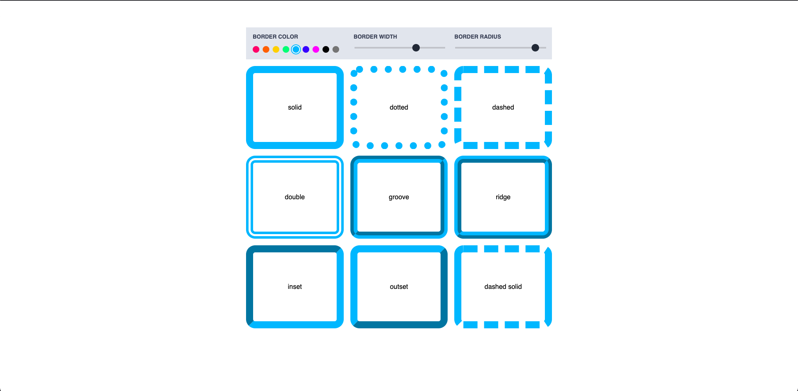

            
# Border Playground
            

## Table of contents

- [Border Playground](#border-playground)
  - [Table of contents](#table-of-contents)
  - [Overview](#overview)
    - [The challenge](#the-challenge)
    - [Screenshot](#screenshot)
    - [Links](#links)
  - [My process](#my-process)
    - [Built with](#built-with)
  - [Author](#author)

## Overview

### The challenge

Users should be able to:

- View the optimal layout for the app depending on their device's screen size
- Change border radius of the items
- Change border color of the items
- Change border width of the items

### Screenshot

### Links

- [Live Site URL](https://border-playground.vercel.app/)

## My process

### Built with

- Flexbox
- Gridbox
- [React](https://reactjs.org/) - JS library
- [Styled Components](https://styled-components.com/) - For styles
- [Vite](https://github.com/vitejs/vite)

## Author

- Website - [Safa Elmali](https://safaelmali.com/)
- Frontend Mentor - [@SafaElmali](https://www.frontendmentor.io/profile/SafaElmali)
- Twitter - [@SafaElmali](https://twitter.com/SafaElmali)
- Github - [@SafaElmali](https://github.com/SafaElmali)
- CSS Battle Dev - [@SafaElmali](https://cssbattle.dev/player/tsafaelmali)
